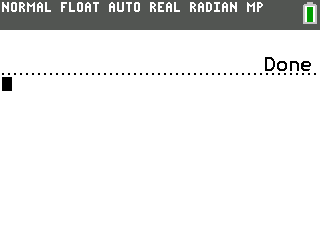
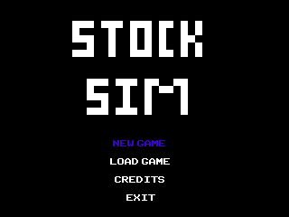

# StockSim v.1 PR Stable  
## Nicholas Pease  
## (LAX18)  
  
### Contents:  
STOCKSIM.8xp                                  Game File  
README.md                                     README  
Screen1.png                                   Picture  
Screen2.png                                   Picture  
License.md                                    License
  
### Screenshots:
  

### About
Thank you for downloading StockSim version 1.0 (Public Release)!!!  
This program was programmed in ICE, a revolutionary programming language created  
and developed by PT_ (or P_T on IRC). Although primarily programed by LAX18, special thanks to  
PT_ for help with optimization of the program (i.e teaching me lists exsist in ICE :P) and   
SM84CE and beckadamtheinventor, for help with the saving and loading to an appvar (along with PT_).  
  
The source WILL NOT be provided in this download, however this can be found and downloaded on my  
GitHub repo (https://github.com/LAX18/StockSim). The source is open, but is protected under MIT  
license.   
  
StockSim is a game originally coded on the Nintendo 3DS via SmileBASIC for CC21. After getting  
various requests (and wanting to do this myself), I ported this to ICE for the TI84+CE. StockSim itself is  
a simulation game based on the American stock market. Players can buy and sell stocks, while monitoring  several  
charts. Players have to determine the best times to sell, whilst monitoring best times to buy other stocks. Players  
can select from EASY and HARD modes and can save/continue their games.  
   
### Installation Instructions:  
(1) Open TiConnect CE  
(2) Connect your calculator to your PC  
(3) Navagate to the "calculator explorer" tab of Ti Connect CE  
(4) Drag and drop "STOCKSIM.8xp" to ^ tab  
(5) Click [Send] on the window that opens up  
  
### To run the program:  
  
#### OS 5.2 and below:  
(1) Press <kbd>[2nd]</kbd><kbd>[0]</kbd> and scroll down to "Asm("  
(2) Press <kbd>[Enter]</kbd> and press <kbd>[PRGM]</kbd>  
(3) Press <kbd>[ALPHA]</kbd><kbd>[ln]</kbd> and scroll down to "*STOCKSIM" (may be without asterisk)  
(4) Press <kbd>[Enter]</kbd><kbd>[Enter]</kbd>
  
#### OS 5.3 and above:  
(1) Press <kbd>[PRGM]</kbd><kbd>[ALPHA]</kbd><kbd>[ln]</kbd> and scroll down to "*STOCKSIM" (may be without asterisk)  
(2) Press <kbd>[Enter]</kbd><kbd>[Enter] </kbd> 
  
### How to play  
You buy and sell stocks to make a profit  
  
### Controls  
<kbd>[Up]</kbd> / <kbd>[Down]</kbd> - Moves Up and Down (Buy and Sell Screens)  
<kbd>[Left]</kbd> / <kbd>[Right]</kbd> - Switched Screens (Content Displayed Changes)  
<kbd>[Y=]</kbd> - Buy Stocks  
<kbd>[Window]</kbd> - Sells Stock  
<kbd>[Zoom]</kbd> - Save  
<kbd>[Trace]</kbd> - Exit Without Saving (Goes to Menu)  
<kbd>[Window]</kbd> = Next Month  
<kbd>[Enter]</kbd> / <kbd>[2nd]</kbd> - Select (Buy, Sell, and Menu screens)  
<kbd>[Clear]</kbd> - Cancel (Exit on Stock Viewing Screens)  
  
### Future Plans:
- Add Graph Viewing function
- Add Previous Purchases with change since purchase
- TV Channel Ticker (Possibly)
- CryptoCurrency version of StockSim
- Multi-Save support
- Remove 100 stock buy limit
  
